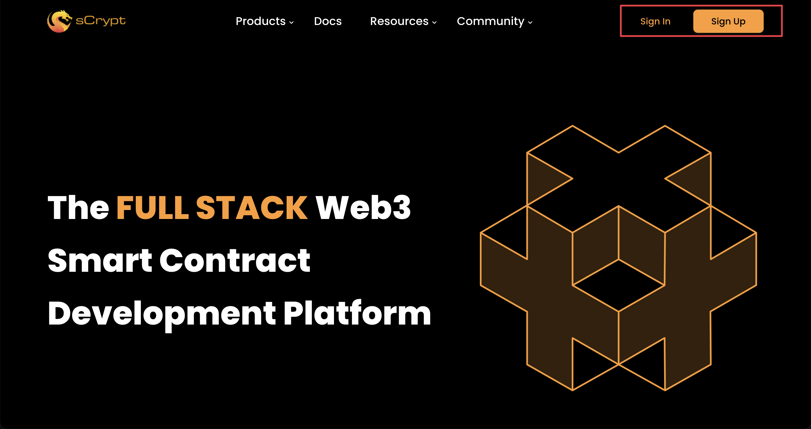

# How to Integrate sCrypt Service

Before interacting with a `sCrypt` contract, we must create a contract instance representing the latest state of the contract on chain. Such an instance can be created by calling the  [`fromTx`](../how-to-deploy-and-call-a-contract/how-to-deploy-and-call-a-contract.md#create-a-smart-contract-instance-from-a-transaction) method. However, this means your application needs to track and record all contract-related transactions, especially for a stateful contract.

An easier alternative is to leverage `sCrypt` infrastructure service, which tracks such transactions, so you can focus on your application logic.

## Get Your API Key

### Step 1: Create Your Free Account

Go to the [sCrypt homepage](https://scrypt.io) to create your free account.



### Step 2: Get API Key

Sign in and click on the copy icon to copy your API Key.


## Integration

Once you have an API key, you can easily integrate sCrypt service into your app by following these simple steps.

### Step 1: Initialize Client

You can pass the API key, along with `network`, to the `Scrypt.init` function to initialize an sCrypt client in your app.

```ts
import { Scrypt, bsv } from 'scrypt-ts'

Scrypt.init({
  apiKey: 'YOUR_API_KEY',
  network: bsv.Networks.testnet,
})
```

### Step 2: Connect `ScryptProvider` with your signer

Connect signer to `ScryptProvider`, the required [provider](../how-to-deploy-and-call-a-contract/how-to-deploy-and-call-a-contract.md#provider) to use sCrypt service.

```ts
const signer = new TestWallet(myPrivateKey)
await signer.connect(new ScryptProvider())
```

### Step 3: Get Contract ID

Each contract is uniquely identified by the transaction that [deploy](../how-to-deploy-and-call-a-contract/how-to-deploy-and-call-a-contract.md#contract-deployment) it and the output it is in, which we regard as its ID.

```ts
const counter = new Counter(0n)
// connect signer
await counter.connect(signer)

const balance = 1
const deployTx = await counter.deploy(balance)
console.log('contract Counter deployed: ', deployTx.id)

const contractId = {
    /** The deployment transaction id */
    txId: deployTx.id,
    /** The output index */
    outputIndex: 0,
}
```

You can usually get the ID of a contract from its creator, who publicizes it so others can interact with it.

### Step 4: Get Contract Instance

Once you have the contract ID, you can easily create a contract instance as follows.

```ts
const currentInstance = await Scrypt.contractApi.getLatestInstance(
  Counter,
  contractId
)

// connect signer
await currentInstance.connect(signer)
```
For a stateless contract, the instance points to the deployment tx; for a stateful one, it points to the latest tip in a chain of txs, which sCrypt service tracks automatically.

## Interact with the Contract
Once you have the instance after following the steps above, you can easily read from the contract, write to it, and listen to it.

### Read

You read an instance's properties using the dot operator, like any other object.

```ts
// read @prop count
console.log(counter.count)
```

:::note
Reading does NOT broadcast a transaction to the blockchain.
:::

### Write

To update a contract instance, you call its public method as [before](../how-to-deploy-and-call-a-contract/how-to-deploy-and-call-a-contract.md#contract-call), which writes to the blockchain by broadcasting a transaction.

```ts
// call the method of current instance to apply the updates on chain
const { tx } = await currentInstance.methods.incrementOnChain()

console.log(`Counter contract called,  tx: ${tx.id}`)
```

### Listen to Events

Often, your app needs to be notified when a contract gets called and updated. It is essential to be able to listen to such events in real time that can alert your app whenever something relevant occurs on chain. For example, in your front-end, you can refresh the web page to show the user the latest state of a contract, upon event notifications.

With the `sCrypt` service, you can easily subscribe to a contract's events by its contract ID, using the `Scrypt.contractApi.subscribe` method. It takes two parameters:

1. `options: SubscribeOptions<T>`: it includes a contract class, a contract ID, and a optional list of method names monitored.

```ts
interface SubscribeOptions<T> {
  clazz: new (...args: any) => T;
  id: ContractId;
  methodNames?: Array<string>;
}
```

If `methodNames` is set, you will be notified only when public functions in the list are called. Otherwise, you will be notified when ANY public function is called.

2. `callback: (event: ContractCalledEvent<T>) => void`: a callback funciton upon receiving notifications.

`ContractCalledEvent<T>` contains relevant information on how the contract is called:

- `methodName: string`, which public method is called

- `args: SupportedParamType[]`, arguments the public method is called with

- `tx: bsv.Transaction`, transaction where contract is called from

- `nexts: Array[T]`, includes the new contract instances created by this call. If a stateful contract is called, `nexts` contains the contract instances containing the new state generated by this call. You can read the latest state from the new contract instance to, e.g., display the new state to users. If a stateless contract is called, `nexts` is empty.

Below is an example of listening to events when `incrementOnChain` method is called.

```ts
const subscription = Scrypt.contractApi.subscribe({
  clazz: Counter, // contract class
  id: contractId, // contract id
  methodNames: ['incrementOnChain']
}, (event: ContractCalledEvent<Counter>) => {
  // callback when receiving a notification
  console.log(`${event.methodName} is called with args: ${event.args}`)
});
```
