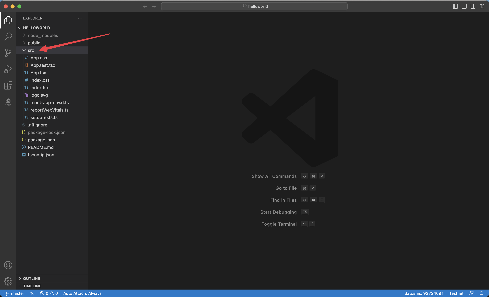
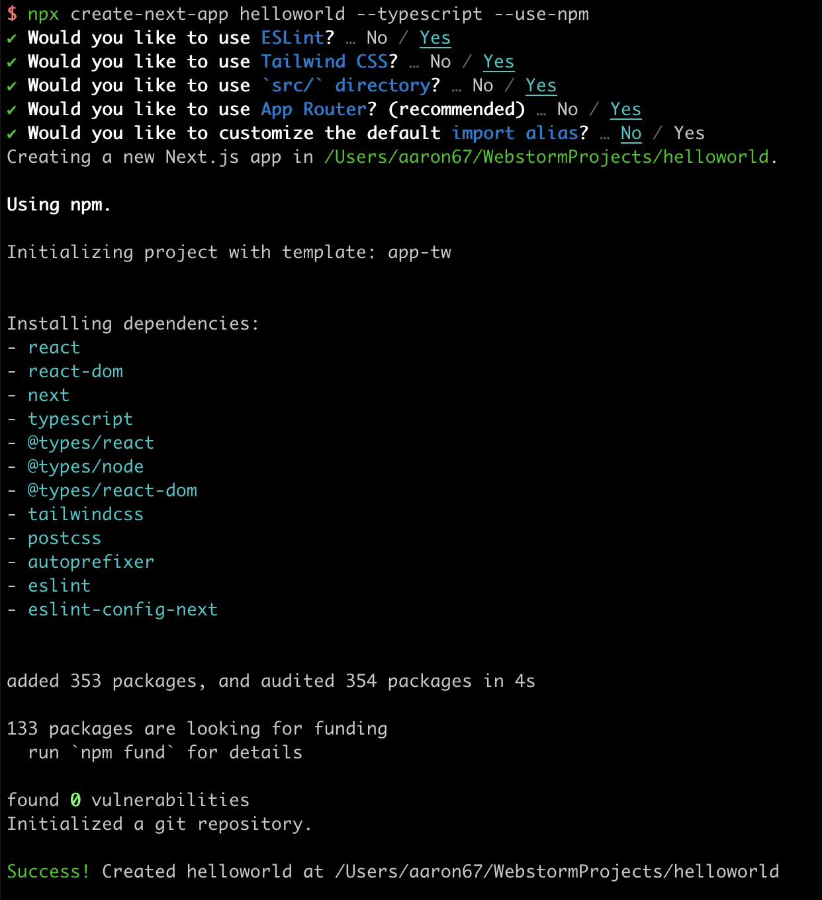
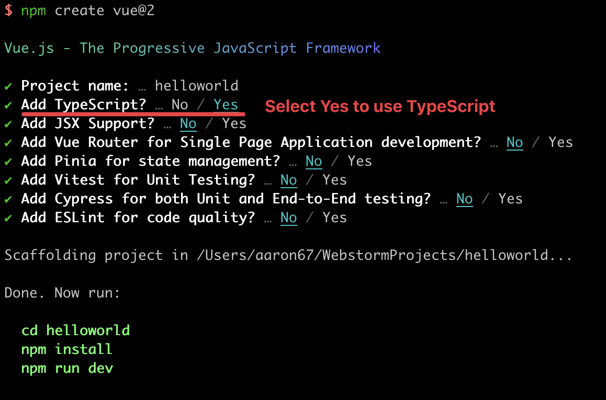
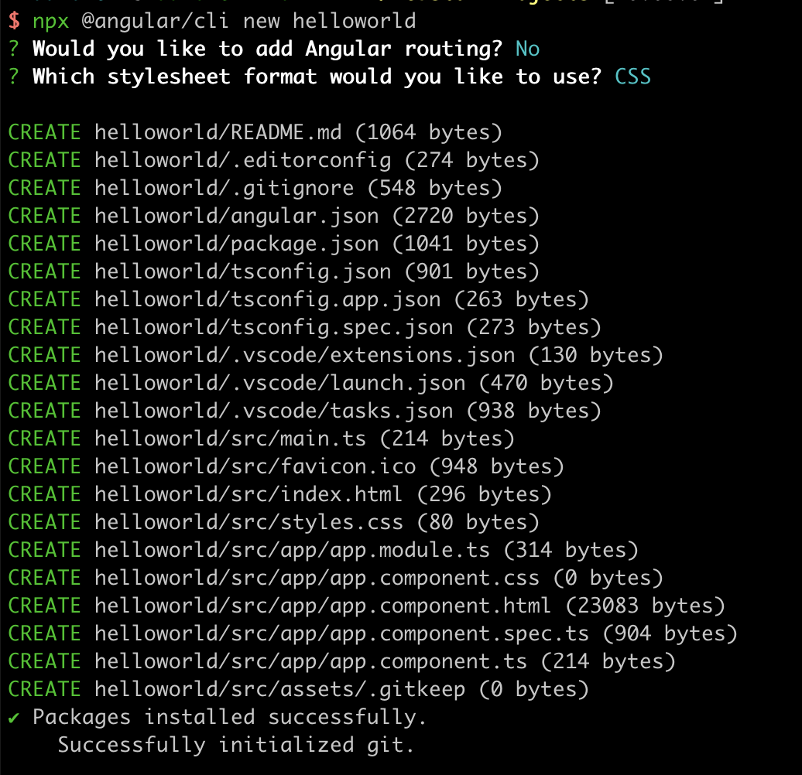
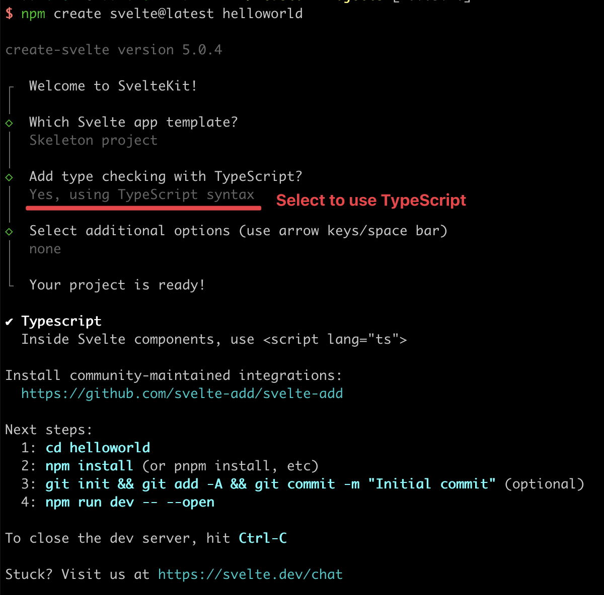

# How to Integrate With a Frontend

This section will show how to integrate your smart contract to a frontend, so users can interact with it.
We assume that you already have the basic knowledge of frontend development, so we will not spend much time introducing this part of the code, but mostly be focusing on how to interact with the smart contract in the front end project.

## Setup

### Step 1
Create your frontend project as usual.
#### React

Run the following command to create a [React](https://react.dev/) project named `helloworld`.

```bash
npx create-react-app helloworld --template typescript
```



We will do most work under the `src` directory.

#### Next.js

Run the following command to create a [Next.js](https://nextjs.org/) project.

```bash
npx create-next-app helloworld --typescript --use-npm
```



#### Vue.js

##### Vite

Run the following command to create a [Vue](https://vuejs.org/) 3.x project bundled with [Vite](https://vitejs.dev/).

```bash
npm create vue@3
```


If you'd like to use Vue 2.x, run the following command to initialize the project scaffold.

```bash
npm create vue@2
```



##### Webpack

Run the following command to create a [Vue](https://vuejs.org/) project bundled with [Webpack](https://webpack.js.org/).

```bash
npx @vue/cli create helloworld
```

:::tip
Vue 3.x and 2.x bundled with Webpack are both supported.
:::

When setting up the project, select `Manually select features` and enable TypeScript.


#### Angular

Run the following command to create an [Angular](https://angular.io/) project.

```bash
npx @angular/cli new helloworld
```



#### Svelte

Run the following command to create a [Svelte](https://svelte.dev/) project.

```bash
npm create svelte@latest helloworld
```



:::note
Currently, we support frontend frameworks [React](https://react.dev), [Next.js](https://nextjs.org/), [Vue](https://vuejs.org/), [Angular](https://angular.io/), and [Svelte](https://svelte.dev/). We anticipate to add support for other frameworks over time.
:::

### Step 2

Run the `init` command of the [CLI](../installation.md#the-scrypt-cli-tool) to add `sCrypt` support in your project.

```bash
cd helloworld
npx scrypt-cli init
```

This command installs the dependencies and configures the contract development environment.
After this, we are ready to go!

## Load Contract

Before interacting with a smart contract at the front end, we need to load the contract class in two steps.


We'll take a look at how to generate the artifact by ourselves first.

### 1. Compile Contract

Before you start, you need to get the contract source files, as a frontend developer.

Let's use the [Helloworld contract](../tutorials/hello-world.md) as an example. Copy and paste `helloworld.ts` into the `src/contracts` directory.


Run the following command to compile the contract.

```bash
npx scrypt-cli compile
```


After the compilation, you will get an JSON artifact file at `artifacts/helloworld.json`.


### 2. Load Artifact

Now with the contract artifact file, you directly load it in the `index.tsx` file.

```ts
import { Helloworld } from './contracts/helloworld';
import artifact from '../artifacts/helloworld.json';
Helloworld.loadArtifact(artifact);
```

Now you can create an instance from the contract class as before.
```ts
const message = toByteString('hello world', true)
const instance = new Helloworld(sha256(message))
```

:::info
You cannot simply call `Helloworld.compile()` at the front end, since it only works in NodeJS, not in browser.
:::

## Integrate Wallet

You will integrate [Panda](https://chromewebstore.google.com/detail/panda-wallet/mlbnicldlpdimbjdcncnklfempedeipj), a browser extension wallet similar to [MetaMask](https://metamask.io/), into the project.

:::info
You can refer to this [guide](../advanced/how-to-add-a-signer.md) to add support for other wallets.
:::

To request access to the wallet, you can use its `requestAuth` method.

```ts
const provider = new DefaultProvider({
    network: bsv.Networks.testnet
});

const signer = new PandaSigner(provider);

// request authentication
const { isAuthenticated, error } = await signer.requestAuth();
if (!isAuthenticated) {
    // something went wrong, throw an Error with `error` message
    throw new Error(error);
}

// authenticated
// you can show user's default address
const userAddress = await signer.getDefaultAddress();
// ...
```

Now you can connect the wallet to the contract instance as before.
```ts
await instance.connect(signer);
```

Afterwards, you can interact with the contract from the front end by [calling its method](../how-to-deploy-and-call-a-contract/how-to-deploy-and-call-a-contract.md#contract-call) as usual.

[This repo](https://github.com/sCrypt-Inc/counter-demos) contains a counter example, integrated with all supported frameworks.

Go to the [sCrypt Academy](https://academy.scrypt.io) to see a step-by-step guide on how to build a Tic-Tac-Toe game on chain.
