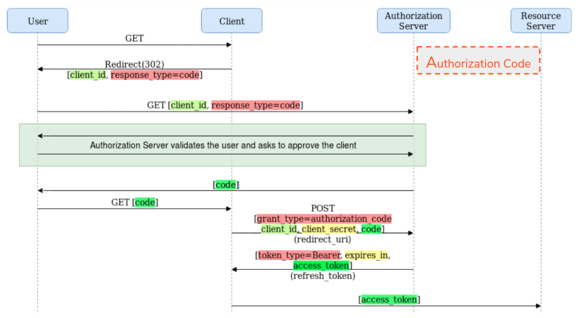

# How to integrate DotWallet


[DotWallet](https://www.dotwallet.com/en) is a lightweight wallet designed to help users easily and securely manage their digital assets. We will introduce how to integrate DotWallet.


## OAuth 2.0


DotWallet user authorization follows the standard authorization code flow of OAuth2. See [RFC6749](https://tools.ietf.org/html/rfc6749#section-4.1) for details. 




[credit to Vihanga Liyanage](https://medium.com/@vihanga_liyanage/iam-for-dummies-oauth-2-grant-types-397197a26024)

User authorization is based on Oauth2's Authorization Code grant. Authorization Code grant flow:

1. Construct URI. 

    Example URI: `https://api.ddpurse.com/v1/oauth2/authorize?client_id=YOUR-CLIENT-ID&redirect_uri=http%3A%2F%2FYOUR-REDIRECT-URL&response_type=code&state=YOUR-STATE&scope=user.info`

    URL Parameters:

    | Parameter    | Required | Description |
    | -------- | ------- | ------- |
    | client_id  | YES    | Developer’s dapp client_id    |
    | redirect_uri | YES     | The redirect URL after authorization. Needs to be url_encoded   |
    | state    | YES   | It is recommended to use a random string of more than 32 bits (such as UUID). The state is used to verify the consistency of the request and callback. This can prevent csrf attacks.  |
    |response_type |YES | Fill in the fixed value : `code` |
    |scope | YES | Authorization scope. The list of permissions that the user agrees to authorize. These permissions are required for certain API endpoints. Needs to be url_encoded. Use spaces to separate multiple permissions. For a list of currently supported scope permissions, please check the scope list below|

2. Redirect the user to the URI constructed in **1**
   
    After clicking the link, the user will be directed to the DotWallet authorization page. DotWallet will ask the user to log in, and then ask whether they agree to authorize the application for the listed permission scopes.

3. Receive the `code` through the callback uri.

    After the user agrees to authorization in **2**, DotWallet will redirect the client to the redirect_uri specified by the application. The authorization code code and the provided state will be included in the query parameters.

4. Exchange code for access_token. The access tokens are credentials used to access protected resources, which are issued by the authorization server.
   
:::warning
To avoid security issues, any request for using or obtaining `access_token` must be made from the backend server. Do not disclose your `access_token` and `client_secret`<sup>1</sup> on the client side.
:::


## DotWallet Developer Platform

1. Before using DotWallet, you need to register and create a app on [DotWallet Developer Platform](https://developers.dotwallet.com/en).


2. After creating the app, you will receive an email containing `app_id` and `secret`.


3. Next, you need to set [redirection URI](https://www.oauth.com/oauth2-servers/redirect-uris). Redirect URLs are a critical part of the OAuth flow. After a user successfully authorizes an application, the authorization server will redirect the user back to the application. For example, in the figure below, we filled in two redirection URIs.
  
- [https://dotwallet-example.vercel.app/callback/](https://dotwallet-example.vercel.app/callback/) is the redirection URI used for product deployment.
- [http://localhost:3000/callback/](http://localhost:3000/callback/) is the redirection URI used for development and debugging.


:::note
*Callback domain* in the form is the redirection URIs in OAuth. 
:::

## Implementation


Here is a code example to create `DotWalletSigner` in [Nextjs](https://nextjs.org/):


1. Construct URI. 

```ts
export default async function Home() {
  const loginUrl = `https://api.ddpurse.com/authorize?client_id=${process.env.CLIENT_ID}&redirect_uri=${encodeURIComponent(
      process.env.REDIRECT_URI || ''
    )}&response_type=code&scope=${encodeURIComponent(
      "user.info"
    )}&state=${crypto.randomUUID()}`;
  
    return (
      <main className="flex min-h-screen flex-col items-center justify-between p-24">
        <div className="m-4 p-4 bg-blue-200 font-bold rounded-lg">
          <a href={loginUrl}>DotWallet Login</a>
        </div>
      </main>
    );
}
```

<center>src/app/page.tsx</center>


If the user clicks the **DotWallet Login** button, the page will be redirected to the authorization server page.


2. After the user clicks **Agree to authorize** to log in, the authorization server redirect the user to the redirection URI. The following code receives the `code` through the callback uri. Then exchange the `code` for `access_token` and save it.

```ts
import { redirect, notFound } from 'next/navigation';

import token from "../token"

export async function GET(request: Request) {
  const { searchParams } = new URL(request.url);
  const code = searchParams.get('code');

  if (code) {
    // exchange the code for access_token
    const res = await fetch(`https://api.ddpurse.com/v1/oauth2/get_access_token`, {
      body: JSON.stringify({
        code,
        redirect_uri: process.env.REDIRECT_URI,
        grant_type: "authorization_code",
        client_secret: process.env.CLIENT_SECRET,
        client_id: process.env.CLIENT_ID,
      }),
      headers: {
        'Content-Type': 'application/json',
      },
      method: 'POST'
    });
    const { code: apiCode, data, msg } = await res.json();

    if (apiCode === 0) {
      const { access_token } = data;
      // save access_token
      token.access_token = access_token;
      // redirect to balance page.
      redirect('/balance');
    }

  }

  notFound();
}
```

<center>src/app/callback/route.ts</center>


### `DotWalletSigner`

sCrypt SDK provides `DotWalletSigner` for quick integration with DotWallet.

After redirect to the `/balance` page, we can create a `DotWalletSigner` with the OAuth access token. 


```ts
import { DotwalletSigner, DefaultProvider } from "scrypt-ts";
import token from "../token";

async function getData() {
  const provider = new DefaultProvider();
  const signer = new DotwalletSigner(token.access_token, provider);

  const balance = await signer.getBalance();

  return { balance: balance.confirmed + balance.unconfirmed };
}

export default async function Balance() {
  const data = await getData();

  return (
    <main className="flex min-h-screen flex-col items-center justify-between p-24">
      <div className="m-4 p-4 bg-blue-200 font-bold rounded-lg">
        <label>balance</label> {data.balance}
      </div>
    </main>
  );
}

```

<center>src/app/balance/page.tsx</center>

After creating `DotWalletSigner` with access token, you can call all interfaces of `DotWalletSigner` as in other signers.

Congrats! You have completed the integration of DotWallet.

Full code is [here](https://github.com/zhfnjust/dotwallet-example).

------------------------

[1] `client_secret` is usually stored in the backend service. It's used to exchange code for access token.
