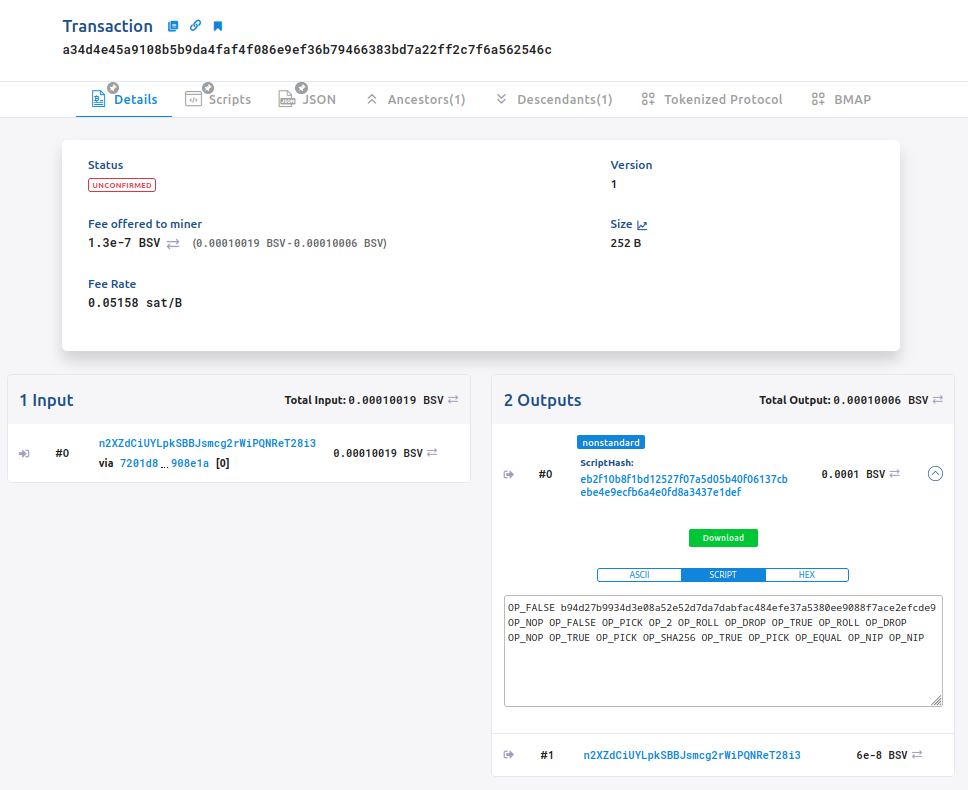
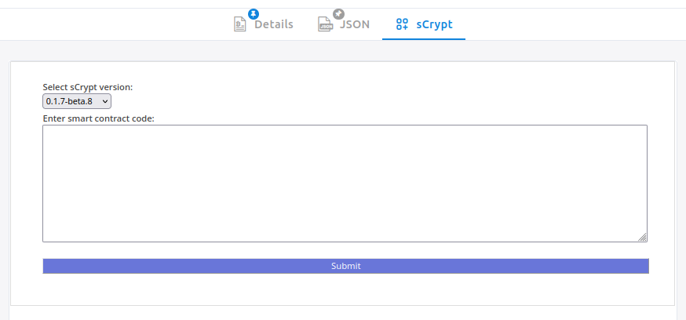

# How to Verify a Deployed Contract

Using [WhatsOnChain](https://whatsonchain.com/) (WoC) you can submit and verify sCrypt code for a deployed contract.

Suppose that you completed the ["Hello World" tutorial](./tutorials/hello-world.md) and deployed a contract instance on the Bitcoin testnet. You've got back the transaction ID of the deployed contract: [`a34d4e45a9108b5b9da4faf4f086e9ef36b79466383bd7a22ff2c7f6a562546c`](https://test.whatsonchain.com/tx/a34d4e45a9108b5b9da4faf4f086e9ef36b79466383bd7a22ff2c7f6a562546c).
If you take a look at the transaction using WoC, you'll see that the first output contains a non-standard script with the hash of `eb2f10b8f1bd12527f07a5d05b40f06137cbebe4e9ecfb6a4e0fd8a3437e1def`. This output contains our contract, compiled to bitcoin script.

The script is open to the public, so in principle anyone may fully examine its logic and determine what kinds of functions and parameters it has.
But, for increasingly complicated contracts, this can become nearly impossible.
As a result, we offer a WhatsOnChain plugin that enables you to upload the original contracts' source code.
After a submission, the plugin confirms that the code truly produces the script contained in the transaction and saves it for later reference. 

## Submitting the Source Code

On the site of the deployed transaction, click on the script hash of the output. It will open a site like this:

In the upper part you'll see the `sCrypt` tab. Click on it. You'll see a very simple form:

In the form you are able to select the version of `scrypt-ts` you've used to compile and deploy the contract, along with a text-box in which you need to paste the smart contract code itself, like so:

Now click `Submit`. After a few seconds, if the code was correct, you should see something like the following:

The page will contain the high-level smart contract code along with the deployed contracts property values. Additionally, the page also has a button to submit code for another version of `scrypt-ts` and  a dropdown menu which let's you switch among versions that already had a submission.

Now, every time someone opens the `sCrypt` tab on [the specified script hash page](https://test.whatsonchain.com/script/eb2f10b8f1bd12527f07a5d05b40f06137cbebe4e9ecfb6a4e0fd8a3437e1def), they will see the same information.