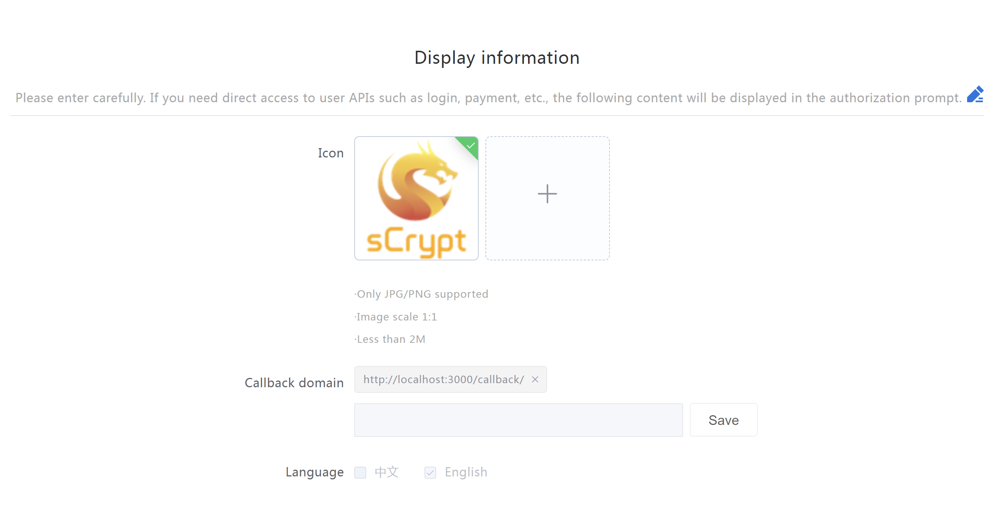
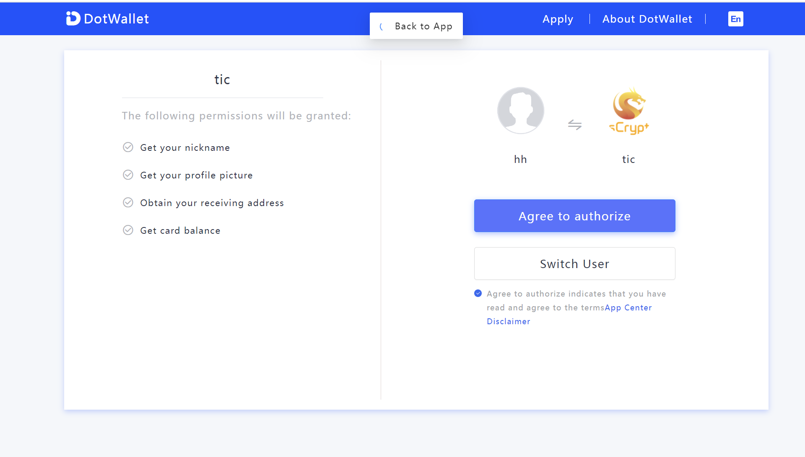

# Tutorial 8: Integrating dotwallet


[DotWallet](https://www.dotwallet.com/en) is a lightweight wallet designed to help users easily and securely manage their digital assets. We will introduce how to integrate dotWallet.


## Dotwallet Developer Platform

dotwallet uses [oauth 2.0 protocol](https://oauth.net/2/) for login.

1. Before using dotwallet, you need to register and create a dApp on dotwallet [Developer Platform](https://developers.dotwallet.com/en).


2. After creating the dApp, you will receive an email containing `app_id` and `secret`.


3. Next, you need to set [redirect-uris](https://www.oauth.com/oauth2-servers/redirect-uris)

For example, in the figure below, [https://classic.scrypt.io/tic-tac-toe](https://classic.scrypt.io/tic-tac-toe) is the address used for product deployment, [http:/ /localhost:3000/tic-tac-toe/](http://localhost:3000/tic-tac-toe/) is used for development and debugging.



## DotwalletSigner

sCrypt SDK provides `DotwalletSigner` for quick integration with dotWallet.

You can use `DotwalletDevOption` or `DotwalletProductionOption` to create `DotwalletSigner`. Note that `DotwalletDevOption` is only for development and debugging, otherwise it will leak your `client_secret` <sup>1</sup> . Production deployment phase should use `DotwalletProductionOption`.


```ts

/**
  * Please note that `DotwalletDevOption` is only used to create DotwalletSigner in development environment.
  * This Option should not be used in a production environment as it will expose your client_secret.
  */
export interface DotwalletDevOption {
     /** `app_id` received in the mail */
     client_id: string;
     /** `secret` received in the mail */
     client_secret: string;
     /** The url filled in the Callback domain */
     redirect_uri: string;
     /** A random string */
     state: string;
}

/**
  * This option can be used in both development environment and production environment.
  * See [access-token]{@link https://oauth.net/2/access-tokens} and [DotWallet APIs for authorization]{@link https://developers.dotwallet.com/documents/en/#authorization } to known how to get an access token.
  */
export interface DotwalletProductionOption {
     accessToken: string;
}


export type DotwalletOption = DotwalletDevOption | DotwalletProductionOption;
```

Here is a code example to create `DotwalletSigner` in `React`:


```ts
const provider = new DefaultProvider();

// state is a random string to request login to dotwallet
const state = localStorage. getItem("state")
? (localStorage. getItem("state") as string)
: crypto.randomUUID();

localStorage.setItem("state", state);

const accessToken = localStorage. getItem("access_token");

const options = accessToken ? { accessToken } : {
     client_id: "c152e571fffb163bc99bb87c51577354",
     client_secret: "243720bb8bb573b3f07f6ba2838f4478",
     redirect_uri: "http://localhost:3000/tic-tac-toe/",
     state: state,
};

const signerRef = useRef(new DotwalletSigner(options, provider));

const signer = signerRef. current;
```


Next is the same as [before](../how-to-integrate-a-frontend.md#integrate-wallet), when the user clicks the login wallet button, call the `requestAuth` method to access the wallet, and jump to dotwallet's authorization page.


```ts
const walletLogin = async () => {
     try {
       const { isAuthenticated, error } = await signer. requestAuth();
       if (!isAuthenticated) {
         throw new Error(error);
       }

       ...

       setConnected(true);
     } catch (error) {
       console.error("sensiletLogin failed", error);
     }
};
```



After the user clicks Authorize to log in, the page will be redirected to the `redirect_uri` given by the dApp. In this example, `redirect_uri` is the current page <sup>2</sup>. We identify whether it is a redirected page by judging whether the current query params has the `state` random string filled in when requesting to log in to the dotwallet. If it is a redirected page, it will automatically call `requestAuth` to get `accessToken`. After successful acquisition, `DotwalletSigner` will automatically save the obtained `accessToken` in `localStorage`. An authorized `DotwalletSigner` can then be created using the `DotwalletProductionOption`.

```ts
useEffect((login = walletLogin) => {
     const urlParams = new URLSearchParams(window. location. search);
     const state = urlParams. get("state");
     // Check if redirected page
     if (state && state === localStorage. getItem("state")) {
         // it's a redirected page and create DotwalletSigner to get accessToken
         login();
     } else if (accessToken) {
         //authorized
         // create DotwalletSigner with accessToken
         login();
     }
}, []);
```

After creating `DotwalletSigner` with `accessToken`, you can call all interfaces of `DotwalletSigner` like calling other [`signer`](../how-to-test-a-contract.md#signer).


So far, we have completed the integration of dotWallet.
------

[1] `client_secret` is usually stored in the backend service. Use the request `accessToken`.

[2] `redirect_uri` only uses the current page during development and debugging. Usually use a backend service as `redirect_uri`. And serve the request `accessToken` on the backend.
