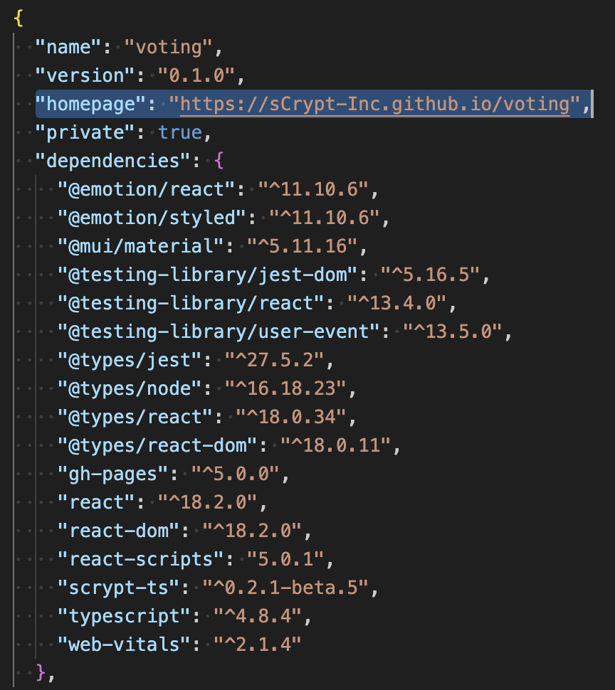
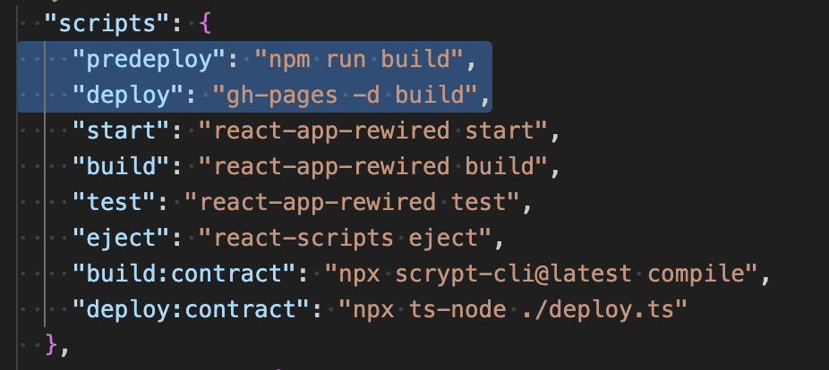
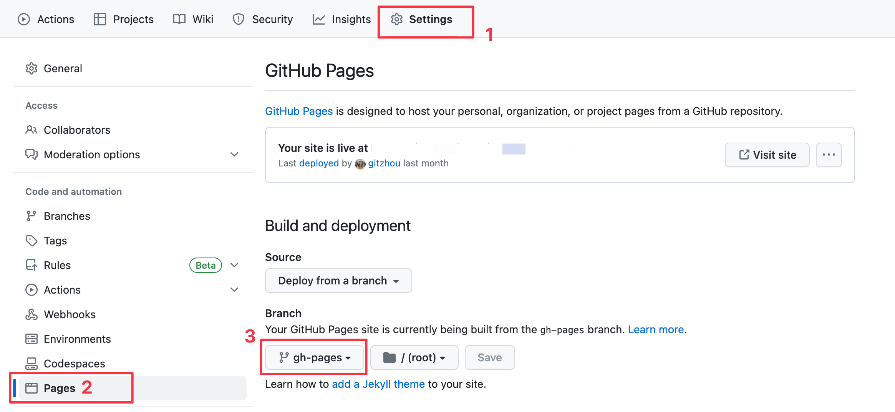

# Tutorial 6: Voting

## Overview

In this tutorial, we will go over how to use sCrypt to build a full-stack voting dApp on Bitcoin, including the smart contract and an interactive front-end.


On the web page, you can see the candidate list. Clicking the like button will cast one vote for the corresponding candidate. This will prompt the wallet to ask for a user's approval. A transaction calling the contract will be sent after her approval.

First, we will write and deploy the smart contract step by step. Afterward, we will build a front-end with React that allows users to cast votes and thus interact with the contract.

## Contract

### Properties

For each candidate, there are two properties we need to store in the contract: her name and her votes received so far.

We define a type alias of `ByteString` to represent a candidate name.

```ts
export type Name = ByteString
```

We define a struct to represent a candidate.

```ts
export type Candidate = {
  name: Name
  votesReceived: bigint
}
```

We use a `FixedArray` to store the list of candidates, which we alias as type `Candidates`.
Since candidates' vote counts can be updated, we mark it [stateful](../how-to-write-a-contract/stateful-contract.md#stateful-properties) by setting `@prop(true)`.

```ts
export const N = 2
export type Candidates = FixedArray<Candidate, typeof N>

export class Voting extends SmartContract {  
  @prop(true)
  candidates: Candidates
  // ...
}
```

### Constructor

Initialize all the `@prop` properties in the constructor. Note that we only need to pass the candidate names in the argument, because the votes they received would be all 0 at the beginning.

```ts
constructor(names: FixedArray<Name, typeof N>) {
  super(...arguments)
  // initialize fixed array
  this.candidates = fill({
      name: toByteString(''),
      votesReceived: 0n
  }, N)
  // set names and set votes they received to 0
  for (let i = 0; i < N; i++) {
    this.candidates[i] = { name: names[i], votesReceived: 0n }
  }
}
```

### Methods

The only way to interact with this contract is to vote for one candidate in the list, so we will have only 1 **public** method `vote`. It takes only 1 parameter: the name of the candidate you want to vote for.

```ts
@method()
public vote(name: Name) {
  // 1) change contract state: add one vote to `candidate` in the list
  // 2) propogate the state
}
```

We can simply use a `for` loop to implement this: find the corresponding candidate in the list by name, then increment its vote by one. We implement this in a helper method `increaseVotesReceived`.

```ts
// cast one vote to a candidate
@method()
increaseVotesReceived(name: Name): void {
  for (let i = 0; i < N; i++) {
    if (this.candidates[i].name === name) {
      this.candidates[i].votesReceived++
    }
  }
}
```

After we increment the candidate's votes and update the contract state, we make sure the new state is maintained in the spending transaction's output [as usual](../how-to-write-a-contract/stateful-contract.md#update-states). Another output is added if change is needed.

```ts
let outputs: ByteString = this.buildStateOutput(this.ctx.utxo.value)
outputs += this.buildChangeOutput()
assert(this.ctx.hashOutputs === hash256(outputs), 'hashOutputs mismatch')
```

The public function `vote` is now finished.

```ts
@method()
public vote(name: Name) {
  // change contract state: add one vote to `candidate` in the list
  this.increaseVotesReceived(name)
  
  // restrict tx outputs
  // to contain the latest state with the same balance
  let outputs: ByteString = this.buildStateOutput(this.ctx.utxo.value)
  // to contain the change output when necessary
  outputs += this.buildChangeOutput()

  assert(this.ctx.hashOutputs === hash256(outputs), 'hashOutputs mismatch')
}
```

### Final Code

You have completed the `Voting` contract! The [final complete code](https://github.com/sCrypt-Inc/voting/blob/master/src/contracts/voting.ts) is as follows:

```ts
import { assert, ByteString, hash256, method, prop, SmartContract, FixedArray, fill, toByteString } from 'scrypt-ts'

export type Name = ByteString

export type Candidate = {
    name: Name
    votesReceived: bigint
}

export const N = 2

export type Candidates = FixedArray<Candidate, typeof N>

export class Voting extends SmartContract {
    @prop(true)
    candidates: Candidates

    constructor(names: FixedArray<Name, typeof N>) {
        super(...arguments)
        // initialize fixed array
        this.candidates = fill({
            name: toByteString(''),
            votesReceived: 0n,
        }, N)
        // set names and set votes they received to 0
        for (let i = 0; i < N; i++) {
            this.candidates[i] = {
                name: names[i],
                votesReceived: 0n,
            }
        }
    }

    /**
     * vote for a candidate
     * @param name candidate's name
     */
    @method()
    public vote(name: Name) {
        // change contract state: add one vote to `candidate` in the list
        this.increaseVotesReceived(name)
        // output containing the latest state and the same balance
        let outputs: ByteString = this.buildStateOutput(this.ctx.utxo.value)
        outputs += this.buildChangeOutput()
        assert(this.ctx.hashOutputs === hash256(outputs), 'hashOutputs mismatch')
    }

    @method()
    increaseVotesReceived(name: Name): void {
        for (let i = 0; i < N; i++) {
            if (this.candidates[i].name === name) {
                this.candidates[i].votesReceived++
            }
        }
    }
}
```

## Frontend

We will add a frontend to the voting smart contract according to [this guide](../how-to-integrate-a-frontend/how-to-integrate-a-frontend.md).

### Setup Project

The front-end will be created using [Create React App](https://create-react-app.dev/).

```bash
npx create-react-app voting --template typescript
```

### Install the sCrypt SDK

The sCrypt SDK enables you to easily compile, test, deploy, and call contracts.

Use the `scrypt-cli` command line to install the SDK.

```bash
cd voting
npx scrypt-cli init
```

This command will create a contract file at `src\contracts\voting.ts`, replace the content of the file with the contract written [above](#final-code).

### Compile Contract

Compile the contract with the following command: 

```bash
npx scrypt-cli compile
```

This command will generate a contract artifact file at `artifacts\src\contracts\voting.json`.

### Contract Deployment

After [installing the sCrypt SDK](#install-the-scrypt-sdk), you will have a script `deploy.ts` in the project directory, which can be used to deploy our `Voting` contract after some minor modifications.

```ts
import { Name, Voting, N } from './src/contracts/voting'
import { bsv, TestWallet, DefaultProvider, toByteString, FixedArray } from 'scrypt-ts'

import * as dotenv from 'dotenv'

// Load the .env file
dotenv.config()

// Read the private key from the .env file.
// The default private key inside the .env file is meant to be used for the Bitcoin testnet.
// See https://scrypt.io/docs/bitcoin-basics/bsv/#private-keys
const privateKey = bsv.PrivateKey.fromWIF(process.env.PRIVATE_KEY || '')

// Prepare signer. 
// See https://scrypt.io/docs/how-to-deploy-and-call-a-contract/#prepare-a-signer-and-provider
const signer = new TestWallet(privateKey, new DefaultProvider({
    network: bsv.Networks.testnet
}))

async function main() {
    await Voting.compile()

    const candidateNames: FixedArray<Name, typeof N> = [
        toByteString('iPhone', true),
        toByteString('Android', true)
    ]

    const instance = new Voting(
        candidateNames
    )

    // Connect to a signer.
    await instance.connect(signer)

    // Contract deployment.
    const amount = 1
    const deployTx = await instance.deploy(amount)
    console.log('Voting contract deployed: ', deployTx.id)
}

main()
```

Before deploying the contract, we need to create a `.env` file and save your private key in the `PRIVATE_KEY` environment variable.

```
PRIVATE_KEY=xxxxx
```

If you don't have a private key, you can follow [this guide](../how-to-deploy-and-call-a-contract/how-to-deploy-and-call-a-contract.md#setup) to generate one using Sensilet wallet, then fund the private key's address with our [faucet](https://scrypt.io/faucet/).

Run the following command to deploy the contract.

```bash
npm run deploy:contract
```

After success, you will see an output similar to the following:


#### Contract ID

Your can get the deployed contract's ID: the TXID and the output index where the contract is located.
```js
const contract_id = {
  /** the deployment transaction id */
  txId: "6751b645e1579e8e6201e3c59b900ad58e59868aa5e4ee89359d3f8ca1d66c8a",
  /** the output index */
  outputIndex: 0,
};
```

### Verify

After a successful deployment of a smart contract, you can verify the deployed contract script:

```sh
npm run verify:contract
```

Upon execution, the designated contract code undergoes verification on sCrypt's servers. If successful, the outcome will be [displayed on WoC](https://test.whatsonchain.com/script/cecb4f8799913df3e5af50bc81a24e3fef3216a92452d27cd97dcd7ccbce1f1b), under the "sCrypt" tab. See the ["How to Verify a Contract"](../how-to-verify-a-contract.md) page for more details.

### Load Contract Artifact

Before writing the front-end code, we need to load the contract artifact in `src\index.tsx`.

```ts
import { Voting } from './contracts/voting';
var artifact = require('../artifacts/src/contracts/voting.json');
Voting.loadArtifact(artifact);
```

### Integrate Wallet

Use `requestAuth` method of `signer` to request access to the wallet.

```ts
// request authentication
const { isAuthenticated, error } = await signer.requestAuth();
if (!isAuthenticated) {
    // something went wrong, throw an Error with `error` message
    throw new Error(error);
}

// authenticated
// ...
```

### Integrate sCrypt Service

To interacte with the voting contract, we need to create a contract instance representing the latest state of the contract on chain. When both Alice and Bob vote on the webpage, we need to ensure that their contract instances are always up to date. After Alice votes, we have to notify Bob that the state of the contract has changed and synchronize his local contract instance to the latest state on chain.

Fortunately,`sCrypt` provides such infrastructure service, which abstracts away all the common complexities of communicating with the blockchain, so we do not have to track the contract state, which could be computationally demanding as blockchain grows. We can instead focus on our application's business logic.

To use it, we first have to initialize it according to [this guide](../advanced/how-to-integrate-scrypt-service.md).

```ts
Scrypt.init({
  apiKey: 'YOUR_API_KEY',
  network: 'testnet'
})
```

### Connect Signer to `ScryptProvider`

It's required to connect your signer to `ScryptProvider` when using sCrypt service.

```ts
const provider = new ScryptProvider();
const signer = new SensiletSigner(provider);

signerRef.current = signer;
```

### Fetch Latest Contract Instance

We can fetch a contract's latest instance by calling the `Scrypt.contractApi.getLatestInstance()` using its [contract ID](#contract-id). With this instance, we can easily read a contract's properties to display to the user on the webpage, or update the contract state by calling its public method as [before](../how-to-deploy-and-call-a-contract/how-to-deploy-and-call-a-contract.md#contract-call) when the user votes for a candidate.

```ts
function App() {
  const [votingContract, setContract] = useState<Voting>();
  const [error, setError] = React.useState("");
  
  // ...

  async function fetchContract() {
    try {
      const instance = await Scrypt.contractApi.getLatestInstance(
        Voting,
        contract_id
      );
      setContract(instance);
    } catch (error: any) {
      console.error("fetchContract error: ", error);
      setError(error.message);
    }
  }
    
  // ...
}
```

### Read contract state

With the contract instance, we can read its lastest state and render it.

```ts
function byteString2utf8(b: ByteString) {
  return Buffer.from(b, "hex").toString("utf8");
}

function App() {
  // ...

  return (
    <div className="App">
      <header className="App-header">
        <h2>What's your favorite phone?</h2>
      </header>
      <TableContainer
        component={Paper}
        variant="outlined"
        style={{ width: 1200, height: "80vh", margin: "auto" }}
      >
        <Table>
          <TableHead>
            <TableRow>
              <TableCell align="center">Iphone</TableCell>
              <TableCell align="center">Android</TableCell>
            </TableRow>
          </TableHead>
          <TableBody>
            <TableRow>
              <TableCell align="center">
                <Box>
                  <Box
                    sx={{
                      height: 200,
                    }}
                    component="img"
                    alt={"iphone"}
                    src={`${process.env.PUBLIC_URL}/${"iphone"}.png`}
                  />
                </Box>
              </TableCell>
              <TableCell align="center">
                <Box>
                  <Box
                    sx={{
                      height: 200,
                    }}
                    component="img"
                    alt={"android"}
                    src={`${process.env.PUBLIC_URL}/${"android"}.png`}
                  />
                </Box>
              </TableCell>
            </TableRow>
            <TableRow>
              <TableCell align="center">
                <Box>
                  <Typography variant={"h1"} >
                    {votingContract?.candidates[0].votesReceived.toString()}
                  </Typography>
                  <Button
                    variant="text"
                    onClick={voting}
                    name={votingContract?.candidates[0].name}
                  >
                    👍
                  </Button>
                </Box>
              </TableCell>

              <TableCell align="center">
              <Divider orientation="vertical" flexItem />
                <Box>
                  <Typography variant={"h1"}>
                    {votingContract?.candidates[1].votesReceived.toString()}
                  </Typography>
                  <Button
                    variant="text"
                    onClick={voting}
                    name={votingContract?.candidates[1].name}
                  >
                    👍
                  </Button>
                </Box>
              </TableCell>
            </TableRow>
          </TableBody>
        </Table>
      </TableContainer>
      <Footer />
      <Snackbar
        open={error !== ""}
        autoHideDuration={6000}
        onClose={handleClose}
      >
        <Alert severity="error">{error}</Alert>
      </Snackbar>

      <Snackbar
        open={success.candidate !== "" && success.txId !== ""}
        autoHideDuration={6000}
        onClose={handleSuccessClose}
      >
        <Alert severity="success">
          {" "}
          <Link
            href={`https://test.whatsonchain.com/tx/${success.txId}`}
            target="_blank"
            rel="noreferrer"
          >
            {`"${byteString2utf8(success.candidate)}" got one vote,  tx: ${
              success.txId
            }`}
          </Link>
        </Alert>
      </Snackbar>
    </div>
  );
}
```

### Update Contract State

To update the contract's state, we need to call its public method. We create a function `voting()` to handle the voting event triggered by a user.

Calling a contract public method is [the same as before](../how-to-deploy-and-call-a-contract/how-to-deploy-and-call-a-contract.md#contract-call).

```ts
async function voting(e: any) {
  // ...

  const signer = signerRef.current as SensiletSigner;

  if (votingContract && signer) {
    const { isAuthenticated, error } = await signer.requestAuth();
    if (!isAuthenticated) {
      throw new Error(error);
    }

    await votingContract.connect(signer);

    // create the next instance from the current
    const nextInstance = votingContract.next();

    const candidateName = e.target.name;

    // update state
    nextInstance.increaseVotesReceived(candidateName);

    // call the method of current instance to apply the updates on chain
    votingContract.methods
      .vote(candidateName, {
        next: {
          instance: nextInstance,
          balance: votingContract.balance,
        },
      })
      .then((result) => {
        console.log(`Voting call tx: ${result.tx.id}`);
      })
      .catch((e) => {
        setError(e.message);
        fetchContract();
        console.error("call error: ", e);
      });
  }
}
```

If successful, you will see the following log in the `console`:

```
Voting call tx: fc8b3d03b8fa7469d66a165b017fe941fa8ab59c0979457cef2b6415d659e3f7
```

### Subscribe to Contract Event

So far, we have a fully working app. However, there is a slight problem. When Alice clicks on the like button for a candadate in her browser, the candidate's vote count in Bob's browser does not increase, unless he manually refreshes. 
We need a way to listen to contract event. 

We call `Scrypt.contractApi.subscribe(options: SubscribeOptions<T>, cb: (e: ContractCalledEvent<T>) => void): SubScription` to subscribe to events that the contract has been called. When a contract gets called and updated, we refresh the UI in real time, re-render all the content on the page and show the updated vote count.

The subscribe function takes 2 parameters:

1. `options: SubscribeOptions<T>`: it includes a contract class, a contract ID, and a optional list of method names monitored.

```ts
interface SubscribeOptions<T> {
  clazz: new (...args: any) => T;
  id: ContractId;
  methodNames?: Array<string>;
}
```

If `methodNames` is set, you will be notified only when public functions in the list are called. Otherwise, you will be notified when ANY public function is called.

2. `callback: (event: ContractCalledEvent<T>) => void`: a callback funciton upon receiving notifications. 

`ContractCalledEvent<T>` contains the relevant information when the contract is called, such as the public function name and function arguments when the call occurs.

```ts
export interface ContractCalledEvent<T> {
  /** name of public function */
  methodName: string;
  /** public function arguments */
  args: SupportedParamType[];
  /** transaction where contract is called from */
  tx: bsv.Transaction;
  /**
   * If a stateful contract is called, `nexts` contains the contract instance containing the new state generated by this call.
   * If a stateless contract is called, `nexts` is empty.
   */
  nexts: Array<T>;
}
```

The code to subscribe to contract events is as follows.

```ts
useEffect(() => {
  const provider = new ScryptProvider();
  const signer = new SensiletSigner(provider);

  signerRef.current = signer;

  fetchContract();

  // subscribe by contract_id
  const subscription = Scrypt.contractApi.subscribe({
    clazz: Voting,
    id: contract_id
  }, (event: ContractCalledEvent<Voting>) => {
    // update the contract instance 
    setSuccess({
      txId: event.tx.id,
      candidate: event.args[0] as ByteString,
    });
    setContract(event.nexts[0]);
  });

  return () => {
    // unsubscribe
    subscription.unsubscribe();
  };
}, []);
```

### Deploy to GitHub Pages

After pushing the frontend project to your GitHub account, it's easy to [publish a website with GitHub Pages](https://create-react-app.dev/docs/deployment/#github-pages), so that users can interact with your dApp with the browser.

#### Step 1. Add `homepage` to `package.json`

Open your `package.json` and add a `homepage` field for your project.

```json
{
  "name": "voting",
  "homepage": "https://[YOUR-GITHUB-USERNAME].github.io/[YOUR-REPO-NAME]"
  ...
}
```



For example, our demo repo is at https://github.com/sCrypt-Inc/voting, so we set

```
https://sCrypt-Inc.github.io/voting
```

as the homepage, where `sCrypt-Inc` is our GitHub username, and `voting` is the repo name.

#### Step 2. Install `gh-pages` and add `scripts` in `package.json`

Run the following command to install the dependency.

```sh
npm install --save gh-pages
```

Then add two scripts in `package.json`.

```json
"scripts": {
  "predeploy": "npm run build",
  "deploy": "gh-pages -d build",
  ...
},
```



:::note
The `predeploy` script will run automatically before `deploy` is run.
:::

#### Step 3. Deploy the site

Run the following command to deploy the website.

```sh
npm run deploy
```

#### Step 4. Update GitHub project settings

After running the `deploy` script, don't forget to update your GitHub project settings to use `gh-pages` branch. Go to `Settings --> Code and automation/Pages`, and select `gh-pages` as the branch used by the GitHub Pages site.



### Conclusion

Congratulations! You have successfully completed a fullstack voting dapp fully on Bitcoin.

The repo is [here](https://github.com/sCrypt-Inc/voting). And an online example is [here](http://classic.scrypt.io/voting).
